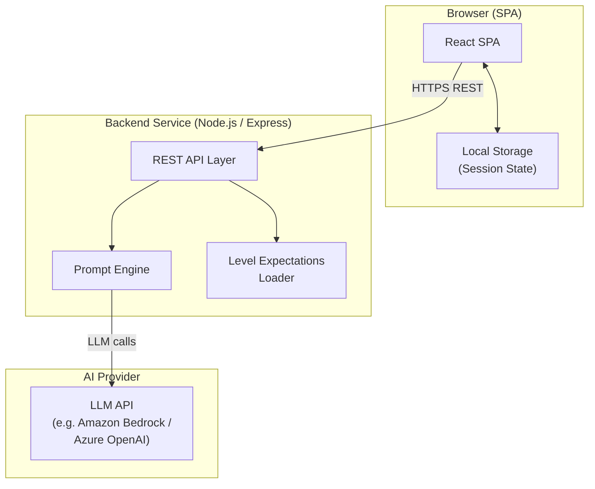
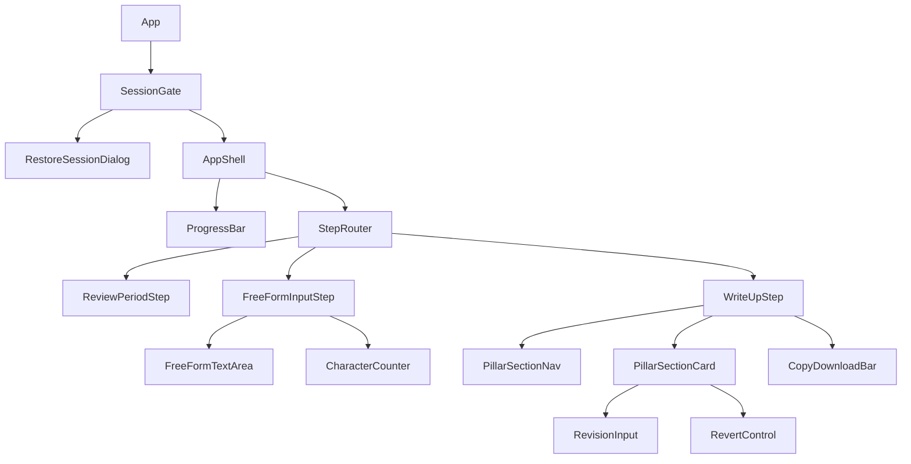

# Design Document: Employee Self-Evaluation Tool

## Overview

The Employee Self-Evaluation Tool is a single-page web application (SPA) that guides employees through a streamlined, AI-assisted self-evaluation process for mid-year and end-of-year performance reviews. The POC targets Sr. Principal level employees in Client Delivery.

The user experience follows a simple 3-step flow:

1. **Review Period Selection** — choose Mid-Year or End-of-Year
2. **Free-form Input** — write all achievements and reflections in a single text area
3. **Write-up Review & Editing** — receive a write-up structured across 4 pillars (one at a time), request revisions per section, copy/download

The AI automatically maps the employee's free-form input to the four evaluation pillars using the level expectations as a reference. No per-pillar guided entry or follow-up questions are required.

All state is persisted to browser local storage. AI capabilities are provided by a lightweight backend service that proxies requests to an LLM API, keeping API keys off the client.

The four evaluation pillars are:
- **Client Delivery** — project outcomes, client relationships, delivery excellence
- **Leadership** — team leadership, mentoring, influence, culture
- **Business Development** — pipeline contribution, proposals, market presence
- **Firm Contribution** — internal initiatives, knowledge sharing, community, operations

---

## Architecture

### High-Level Architecture



### Key Architectural Decisions

**Frontend-only local storage persistence** — All session data lives in the browser. No user data is stored server-side. The backend is stateless and only processes AI requests.

**Thin backend proxy** — The backend's sole purpose is to hold AI API credentials, apply prompt templates, and forward requests to the LLM provider. This keeps the client lightweight and credentials secure.

**Level expectations as static JSON** — Level expectations content is authored once as a versioned JSON file bundled with the frontend. This avoids the overhead of a database for the POC while keeping content easy to update.

**Single free-form input with AI pillar mapping** — Rather than guiding the employee through each pillar individually, the system accepts one free-form text input and uses the LLM to intelligently map contributions to the appropriate pillars during write-up generation.

**One-pillar-at-a-time write-up review** — After generation, pillar sections are presented one at a time for focused review and revision, reducing cognitive load.

---

## Components and Interfaces

### Frontend Component Tree



### Component Responsibilities

| Component | Responsibility |
|---|---|
| `SessionGate` | Detects saved session on mount, shows restore/new dialog |
| `AppShell` | Persistent chrome: progress indicator, review-period badge, start-over button |
| `ProgressBar` | Visual indicator of current step |
| `ReviewPeriodStep` | First step; blocks forward navigation until selection made |
| `FreeFormInputStep` | Single textarea for all achievements and reflections; character counter; generate button |
| `FreeFormTextArea` | Controlled textarea with live validation (10,000 char limit) |
| `CharacterCounter` | Live keystroke counter; turns red at/above 10,000 chars |
| `WriteUpStep` | Rendered write-up in one-pillar-at-a-time view; revision and revert per section |
| `PillarSectionNav` | Navigation controls to move between the 4 pillar sections |
| `PillarSectionCard` | One pillar section with label, body, revision field, revert button |
| `RevisionInput` | Textarea for revision notes/additional info; max 1,000 chars |
| `RevertControl` | Button to restore previous section version; only shown after first revision |
| `CopyDownloadBar` | Copy-to-clipboard and download-as-file actions |

### Backend API Endpoints

| Method | Path | Description |
|---|---|---|
| `GET` | `/api/level-expectations/:level/:practice` | Returns level expectations JSON for given level + practice (POC: `sr-principal/client-delivery`) |
| `POST` | `/api/generate-writeup` | Accepts free-form input + level expectations; generates all 4 pillar sections by mapping input to pillars |
| `POST` | `/api/revise-section` | Regenerates a single pillar section given the original input, current section text, and revision notes |

All endpoints return `application/json`. Errors return `{ error: string, code: string }` with appropriate HTTP status codes.

---

## Data Models

### Session State (Local Storage)

The entire session is serialized as a single JSON object under the key `ese_session_v1`.

```typescript
interface SessionState {
  version: 1;
  savedAt: string;             // ISO 8601 timestamp
  reviewPeriod: 'mid-year' | 'end-of-year' | null;
  currentStep: WorkflowStep;
  freeFormInput: string;       // max 10,000 chars
  writeUp: WriteUpState | null;
}

type PillarId = 'client-delivery' | 'leadership' | 'business-development' | 'firm-contribution';

type WorkflowStep =
  | 'review-period-selection'
  | 'free-form-input'
  | 'write-up';
```

### Write-up State

```typescript
interface WriteUpState {
  generatedAt: string;           // ISO 8601
  activePillarIndex: number;     // 0–3; which pillar is currently displayed
  sections: Record<PillarId, WriteUpSection>;
}

interface WriteUpSection {
  pillarId: PillarId;
  currentText: string;
  previousText: string | null;   // populated after first revision; null otherwise
  wordCount: number;
  generationVersion: number;     // increments on each regeneration
}
```

### Level Expectations (Static JSON)

Bundled as `src/data/level-expectations.json`. Structure unchanged:

```typescript
interface LevelExpectationsFile {
  level: string;           // e.g. "sr-principal"
  practice: string;        // e.g. "client-delivery"
  version: string;         // e.g. "2024-H1"
  pillars: Record<PillarId, PillarExpectations>;
}

interface PillarExpectations {
  pillarId: PillarId;
  displayName: string;
  description: string;
  criteria: ExpectationCriterion[];
}

interface ExpectationCriterion {
  id: string;
  dimension: Dimension;
  text: string;
}

type Dimension =
  | 'quantifiable-impact'
  | 'stakeholder-reach'
  | 'leadership-behaviors'
  | 'strategic-alignment'
  | 'business-outcomes';
```

### API Request/Response Shapes

```typescript
// POST /api/generate-writeup
interface GenerateWriteUpRequest {
  reviewPeriod: 'mid-year' | 'end-of-year';
  freeFormInput: string;         // max 10,000 chars
  levelExpectations: LevelExpectationsFile;
}

interface GenerateWriteUpResponse {
  sections: Record<PillarId, { text: string; wordCount: number }>;
}

// POST /api/revise-section
interface ReviseSectionRequest {
  reviewPeriod: 'mid-year' | 'end-of-year';
  pillarId: PillarId;
  currentText: string;
  revisionNote: string;          // max 1,000 chars — additional info or correction
  originalFreeFormInput: string; // full original input for context
  expectations: PillarExpectations;
}

interface ReviseSectionResponse {
  text: string;
  wordCount: number;
}
```

---

## AI / LLM Integration

### Prompt Design

The backend uses a **system + user message** pattern. The system prompt establishes persona, constraints, and output format. The user message carries the employee's content.

**Write-up generation prompt (system):**
```
You are an expert career coach writing a first-person self-evaluation narrative 
for a {level} {practice} professional covering their {reviewPeriod} performance.

Your task: read the employee's free-form input below and generate a structured 
write-up with a dedicated section for each of the four evaluation pillars:
- Client Delivery
- Leadership  
- Business Development
- Firm Contribution

Map the employee's contributions to the most appropriate pillars based on the 
level expectations provided. Each pillar section should draw from the input 
wherever relevant. If a pillar has limited relevant content in the input, 
write a brief section acknowledging limited information rather than fabricating.

Rules:
- Write in first-person voice using complete sentences and formal vocabulary
- No slang, casual expressions, or contractions
- Each pillar section must be 150–350 words
- Each section must reference at least one specific achievement or reflection from the input
- Each section must address at least one behavioral demonstration or measurable impact
- {midYearFraming | endOfYearFraming}

Level expectations by pillar:
{allPillarExpectationsText}

Return JSON: { "sections": { "<pillarId>": { "text": string, "wordCount": number } } }
```

**Mid-year framing instruction:** "Frame all contributions as progress to date and ongoing work."  
**End-of-year framing instruction:** "Frame all contributions as full-year achievements and completed outcomes."

**Revision prompt (system):**
```
You are an expert career coach revising a single section of a first-person 
self-evaluation for a {level} {practice} professional.

The employee has provided additional information or corrections for the 
{pillarDisplayName} section. Incorporate this feedback into a revised section.

Rules (same as generation):
- First-person voice, complete sentences, formal vocabulary, no contractions
- 150–350 words
- Reference specific achievements from the original input and any new details provided
- Address behavioral demonstrations or measurable impact

Level expectations for {pillarDisplayName}:
{criteriaText}

Return JSON: { "text": string, "wordCount": number }
```

### Prompt Injection Defense

All user-supplied text (free-form input, revision notes) is:
1. Truncated to its defined maximum before being embedded in prompts
2. Wrapped in XML-style delimiters (`<employee_input>...</employee_input>`) so the model treats it as data, not instructions
3. Validated server-side for maximum length before processing

### LLM Provider Abstraction

```typescript
interface LLMAdapter {
  complete(systemPrompt: string, userMessage: string, options?: CompletionOptions): Promise<string>;
}
```

Concrete adapters: `BedrockAdapter` (Amazon Bedrock Converse API), `AzureOpenAIAdapter`. The active adapter is selected via environment variable `LLM_PROVIDER`.

### Response Parsing

All LLM responses are expected as JSON. The backend:
1. Parses the JSON response
2. Validates structure against a Zod schema
3. Returns a typed error if validation fails (triggering the frontend error flow)

---

## Level Expectations Data Storage Strategy

For the POC, level expectations are stored as a **static JSON file bundled with the frontend** (`src/data/level-expectations.json`). This file is:
- Committed to source control alongside the application code
- Loaded at app startup and cached in React context
- Sent as part of the write-up generation request payload so the backend has full criteria context for pillar mapping

The backend also serves expectations via `GET /api/level-expectations/:level/:practice` by reading the same JSON from disk.

---

## Local Storage Schema

| Key | Type | Description |
|---|---|---|
| `ese_session_v1` | `SessionState` (JSON) | Complete session state; expires after 7 days |

**Session lifecycle:**
1. On app load, check for `ese_session_v1`
2. If found and `savedAt` is within 7 days → offer restore dialog
3. If found and `savedAt` is older than 7 days → silently discard and start fresh
4. On every input change event → serialize and write `ese_session_v1`
5. On confirmed "Start Over" → `localStorage.removeItem('ese_session_v1')`

**Storage unavailability:** Wrapped in try/catch. If `localStorage.setItem` throws, the app sets a `storageUnavailable` flag and renders the persistent warning banner (Requirement 6.6).

---

## Key UI Screens and Interactions

### Screen 1: Review Period Selection

- Full-viewport centered card with two large toggle buttons: "Mid-Year" and "End-of-Year"
- No other controls enabled until selection is made
- Selected state: button gains filled/active style; a persistent badge ("Mid-Year Review") appears in the app header
- "Continue" button becomes enabled after selection

### Screen 2: Free-form Input

```
┌─────────────────────────────────────────────────────────────┐
│  Header: [Badge: Mid-Year] ............. [Start Over]        │
│  Progress: ● Input  ○ Write-up                               │
├─────────────────────────────────────────────────────────────┤
│                                                              │
│  Tell us about your contributions                            │
│  ─────────────────────────────────────────────────────────  │
│  Describe your achievements, projects, leadership moments,   │
│  and any contributions you want to highlight this period.    │
│  The system will organize your input across the four         │
│  evaluation pillars automatically.                           │
│                                                              │
│  [                                                           │
│   large free-form textarea, 10,000 chars max                 │
│                                                              │
│                                                              │
│  ]                                                           │
│                                                              │
│  [chars: 843 / 10,000]                                       │
│                                                              │
│                        [Generate Write-up →]                 │
└─────────────────────────────────────────────────────────────┘
```

- Character counter turns red at 10,000 chars; Generate button disabled above limit or when empty
- Loading state shown while AI generates (spinner, "Generating your write-up...")

### Screen 3: Write-up — One Pillar at a Time

```
┌─────────────────────────────────────────────────────────────┐
│  Your Self-Evaluation            [Copy All]  [Download All]  │
│  ─── Pillar 1 of 4: Client Delivery ─────────────────────── │
├─────────────────────────────────────────────────────────────┤
│                                                              │
│  Client Delivery                                             │
│  ─────────────────────────────────────────────────────────  │
│  [Generated paragraph text...]                               │
│                                                              │
│  Add more information or request changes:                    │
│  [textarea 1000 chars]         [Regenerate Section]          │
│  [Revert to previous]  (shown only after first revision)     │
│                                                              │
├─────────────────────────────────────────────────────────────┤
│                  [← Previous]        [Next: Leadership →]    │
└─────────────────────────────────────────────────────────────┘
```

- Each pillar section shown individually; navigation arrows to move between all 4
- Revision field labeled "Add more information or request changes" to make it clear additional info is welcome
- Regeneration shows an inline spinner; timeout at 30 seconds triggers error
- Revert control only appears after at least one revision
- Copy/Download actions at the top copy/download the full write-up (all 4 sections)

---

## Technology Stack

### Frontend

| Concern | Recommendation | Rationale |
|---|---|---|
| Framework | **React 18** (Vite) | Mature ecosystem, hooks-based state management, fast HMR |
| State management | **Zustand** | Lightweight, minimal boilerplate; easy local-storage middleware |
| Styling | **Tailwind CSS** | Utility-first; responsive breakpoints built in |
| Accessibility | **Radix UI** primitives | Headless, WCAG-compliant interactive components (dialogs, toggles) |
| Forms | **React Hook Form** | Performant controlled inputs with validation |
| HTTP client | **fetch** (native) + **React Query** | SWR caching, loading/error states, retry logic out of the box |
| Testing | **Vitest** + **React Testing Library** | Fast, Jest-compatible |
| PBT | **fast-check** | Property-based testing for pure logic functions |

### Backend

| Concern | Recommendation | Rationale |
|---|---|---|
| Runtime | **Node.js 20 LTS** | Same language as frontend; good LLM SDK support |
| Framework | **Express 5** | Minimal; sufficient for a thin proxy service |
| LLM SDK | **AWS SDK v3** (Bedrock) or **openai** npm package | Provider-specific; swapped via adapter |
| Validation | **Zod** | Runtime schema validation for LLM response parsing |
| Testing | **Vitest** | Consistent with frontend toolchain |

### Deployment (POC)

- **Frontend:** Static hosting (S3 + CloudFront, Vercel, or Netlify)
- **Backend:** Single container or serverless function (AWS Lambda + API Gateway, or a small EC2/ECS service)
- **No database required** for the POC

---

## Correctness Properties

### Property 1: Review Period Framing Applied to Prompts

*For any* review period selection (`mid-year` or `end-of-year`), every prompt constructed for write-up generation SHALL contain the framing string corresponding to that review period and SHALL NOT contain the framing string for the other review period.

**Validates: Requirements 1.3**

---

### Property 2: All Pillar Expectations Embedded in Generation Prompt

*For any* write-up generation request, the constructed prompt SHALL contain the expectations criteria text for all four pillars so the model can map input appropriately.

**Validates: Requirements 2.3, 4.1**

---

### Property 3: Input Character Limit Enforcement

*For any* string entered into the free-form input field, the submission control SHALL be enabled if and only if the character count is greater than 0 and less than or equal to 10,000; for any string with a character count greater than 10,000, the submission control SHALL be disabled and the counter SHALL display a visual limit-reached indicator.

**Validates: Requirements 3.2, 3.4, 7.3**

---

### Property 4: Whitespace-Only Input Is Treated as Empty

*For any* string whose trimmed value is the empty string (i.e., composed entirely of whitespace characters), the input validation function SHALL classify it as empty and prevent submission.

**Validates: Requirements 3.5, 7.4**

---

### Property 5: Write-up Contains All Four Pillar Sections

*For any* successful write-up generation response, the response SHALL contain a section for all four pillar IDs: `client-delivery`, `leadership`, `business-development`, `firm-contribution`.

**Validates: Requirements 4.1**

---

### Property 6: Write-up Generation Prompt Contains Formal Voice Instructions

*For any* write-up generation request, the constructed system prompt SHALL contain explicit instructions for: first-person voice, complete sentences, formal vocabulary, and the prohibition of contractions and casual expressions.

**Validates: Requirements 4.2**

---

### Property 7: Live Character Counter Matches Actual Input Length

*For any* string typed into the free-form text area, the displayed character counter value SHALL equal the exact Unicode character count (`string.length`) of the current field value, and SHALL update after every keystroke without delay.

**Validates: Requirements 3.3, 7.2**

---

### Property 8: Section Revision Does Not Affect Other Sections

*For any* pillar section that is revised, all other pillar sections' `currentText` values SHALL remain identical to their values before the revision request was submitted.

**Validates: Requirements 5.4**

---

### Property 9: Revert Restores Previous Section Text

*For any* pillar section that has been regenerated at least once, activating the "Revert" control SHALL set the section's `currentText` to the value that `currentText` held immediately before the most recent regeneration was applied.

**Validates: Requirements 5.5**

---

### Property 10: Revision Field Enforces 1,000-Character Limit

*For any* pillar section in the write-up view, a revision input field SHALL be present; the "Regenerate Section" button SHALL be disabled if the revision field exceeds 1,000 characters or is empty.

**Validates: Requirements 5.3**

---

### Property 11: Session Serialization Round-Trip Preserves All State

*For any* valid `SessionState` object, serializing it to JSON and then deserializing it back SHALL produce an object that is deeply equal to the original across all fields.

**Validates: Requirements 6.3, 8.4**

---

### Property 12: Session Restore Offered Iff Session Age Is At Most 7 Days

*For any* `savedAt` timestamp stored in the session, the application SHALL offer the restore dialog if and only if the difference between the current time and `savedAt` is less than or equal to 7 days (604,800,000 milliseconds); sessions older than 7 days SHALL be silently discarded.

**Validates: Requirements 6.2**

---

### Property 13: Session State Persisted on Every Input Change

*For any* mutation to session state (text input, write-up update, step transition), the serialized JSON written to `localStorage['ese_session_v1']` after the mutation SHALL reflect the updated value in the corresponding field.

**Validates: Requirements 6.1**

---

### Property 14: Progress Indicator Reflects Current Step

*For any* valid `WorkflowStep`, the progress indicator component SHALL display a label that accurately identifies the current step, and SHALL update whenever the step changes.

**Validates: Requirements 8.3**

---

### Property 15: Word Count Calculation Is Accurate

*For any* string of text, the word count function SHALL return a value equal to the number of whitespace-delimited tokens after trimming, and this SHALL equal the `wordCount` field stored in the corresponding `WriteUpSection`.

**Validates: Requirements 4.4**

---

## Error Handling

### Error Categories and Responses

| Error | User-Facing Behavior | Data Impact |
|---|---|---|
| Level expectations load failure | Inline error with "Retry" or "Proceed without expectations" option; blocks progression unless user explicitly acknowledges | None — session state unchanged |
| Write-up generation failure | Full-screen error with "Retry" button; descriptive message | No write-up stored; all input retained |
| Section regeneration failure | Inline alert on that section; current text preserved; "Retry" available; 30-second timeout triggers same treatment | Previous text retained; no version change |
| Local storage unavailable/full | Persistent banner at top of page for duration of session | Inputs still work in memory; data not persisted |
| Network disconnection (transient) | React Query automatic retry with exponential back-off (3 attempts); spinner during retries | No data loss; in-memory state preserved |
| Corrupt/incomplete saved session | Warning dialog on restore attempt; offers "Start fresh" | Clears corrupt data and starts clean |

### Error Message Guidelines

- Messages are written in plain language, avoiding HTTP codes or stack traces
- Each error message identifies **what went wrong**, **what the user can do**, and **whether their data is safe**
- Error states are announced to screen readers via `aria-live="polite"` regions

---

## Testing Strategy

### Unit Tests

Focused on pure logic layers:
- Session state serialization / deserialization
- Character count validation (whitespace trimming, limit enforcement)
- Step transition guard logic
- Word count calculation

### Property-Based Tests (fast-check)

Verify correctness properties hold for arbitrary inputs — see Correctness Properties section above.

### Integration Tests

- Session restore reconstructs all state from serialized JSON
- Start-over clears session and resets to step 1
- Free-form input validation gates the generate button correctly

### End-to-End Tests (Playwright)

- Full happy path: review period selection → free-form input → generate → navigate through all 4 pillar sections → copy and download
- Session restore: refresh mid-session, restore, verify all state intact
- Storage unavailable: banner appears, app remains functional
